# Audio Engine Flowchart

This document contains flowcharts showing the architecture and data flow of the audio engine.

## 🎯 Main System Architecture

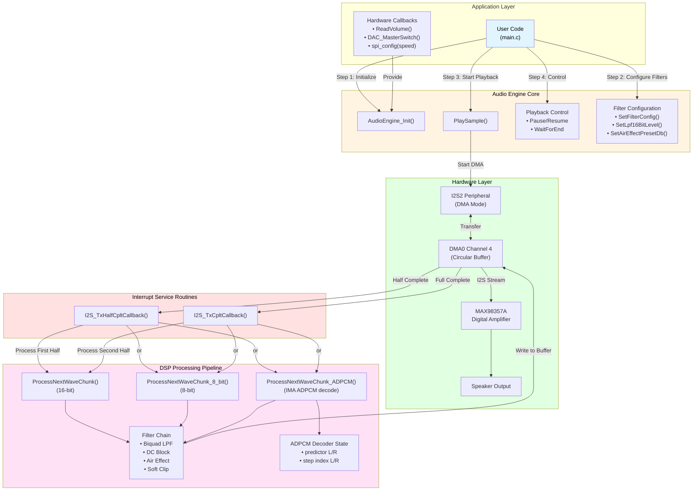

## 🔄 Playback Initialization Flow

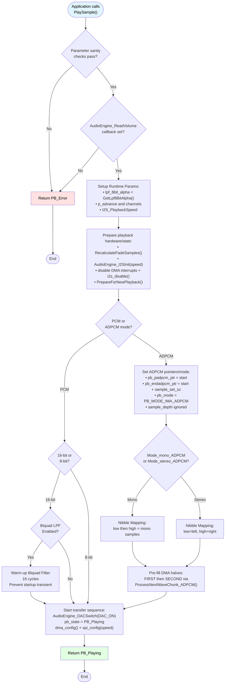

## 🎚️ DMA Interrupt Processing Flow

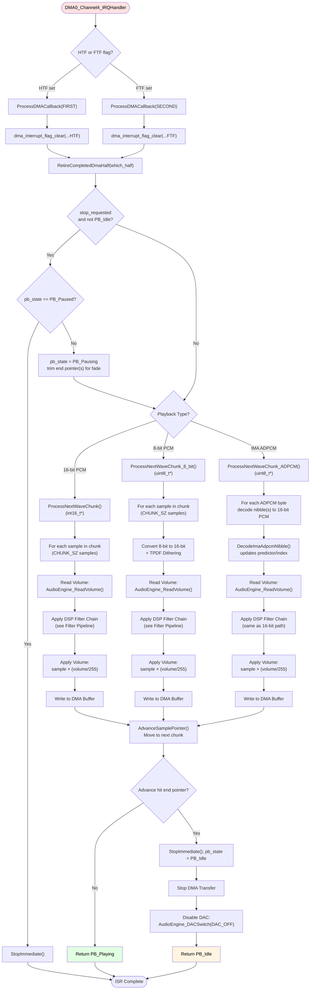

## 🧩 ADPCM Decode Path Details

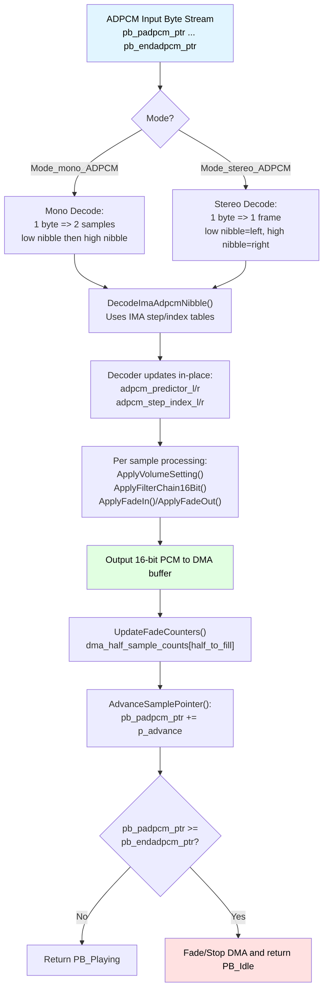

## 🎛️ DSP Filter Chain Pipeline (16-bit)

```mermaid
flowchart LR
  Input["Input Sample<br/>(16-bit signed)"] --> BiquadCheck{Biquad LPF<br/>Enabled?}
  
  BiquadCheck -->|Yes| Biquad["Biquad Low-Pass Filter<br/>α = 0.625 to 0.97<br/>Second-order IIR"]
  BiquadCheck -->|No| DCCheck
  
  Biquad --> DCCheck{DC Blocking<br/>Enabled?}
  
  DCCheck -->|Yes| DCFilter["DC Blocking Filter<br/>α = 0.98 (standard)<br/>or 0.995 (soft)<br/>Remove DC offset"]
  DCCheck -->|No| AirCheck
  
  DCFilter --> AirCheck{Air Effect<br/>Enabled?}
  
  AirCheck -->|Yes| AirEffect["Air Effect High-Shelf<br/>Boost high frequencies<br/>+1, +2, or +3 dB presets"]
  AirCheck -->|No| FadeCheck
  
  AirEffect --> FadeCheck{Fade In/Out<br/>Active?}
  
  FadeCheck -->|Yes| Fade["Apply Fade Ramp<br/>Quadratic curve<br/>Smooth transitions"]
  FadeCheck -->|No| NoiseCheck
  
  Fade --> NoiseCheck{Noise Gate<br/>Enabled?}
  
  NoiseCheck -->|Yes| NoiseGate["Noise Gate<br/>Threshold: ±512<br/>Silence low-level noise"]
  NoiseCheck -->|No| ClipCheck
  
  NoiseGate --> ClipCheck{Soft Clipping<br/>Enabled?}
  
  ClipCheck -->|Yes| Clip["Soft Clipping<br/>Cubic curve above ±28,000<br/>Prevent harsh distortion"]
  ClipCheck -->|No| Output
  
  Clip --> Output["Output Sample<br/>(Filtered 16-bit)"]

  style Input fill:#e1f5ff,color:#000000
  style Output fill:#e1ffe1,color:#000000
  style Biquad fill:#ffe1f5,color:#000000
  style DCFilter fill:#fff4e1,color:#000000
  style AirEffect fill:#f5e1ff,color:#000000
  style Fade fill:#e1ffe1,color:#000000
  style NoiseGate fill:#ffe1e1,color:#000000
  style Clip fill:#ffe1f5,color:#000000
```

## 🎛️ DSP Filter Chain Pipeline (8-bit)

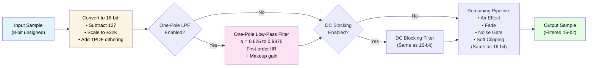

## 🔧 Filter Configuration Flow

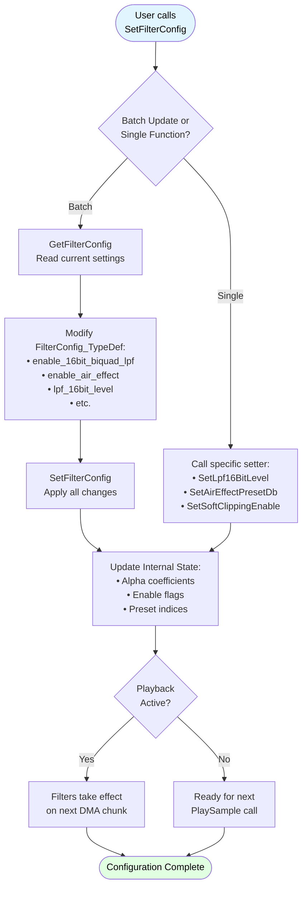

## 🎚️ Volume Control Flow

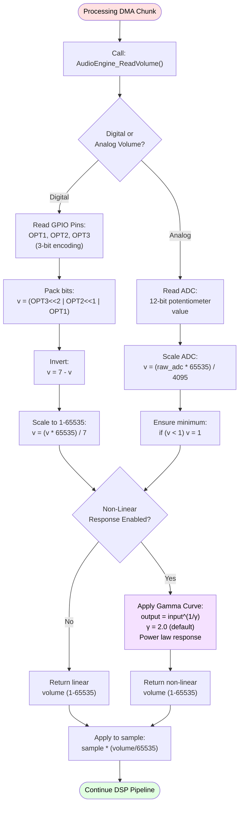

## 📊 State Machine Diagram

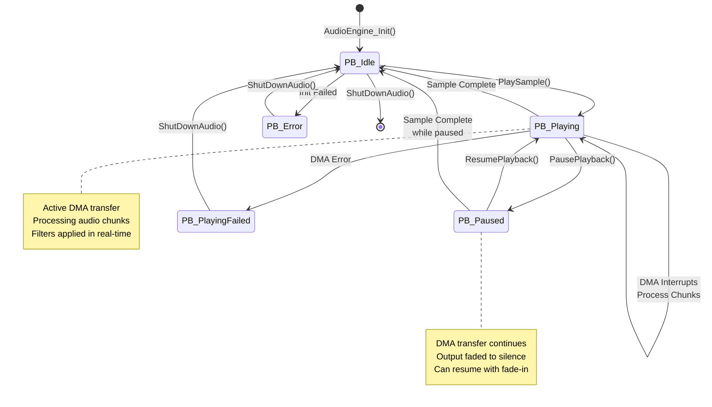

## 🔄 Air Effect Preset Auto-Control

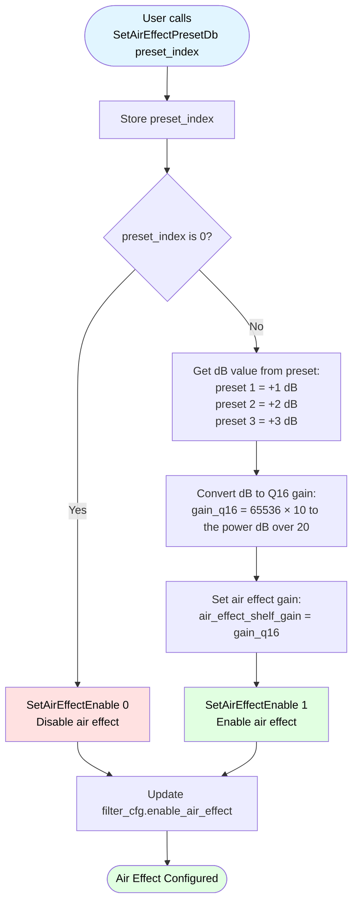

## 📈 Buffer Management (Ping-Pong DMA)

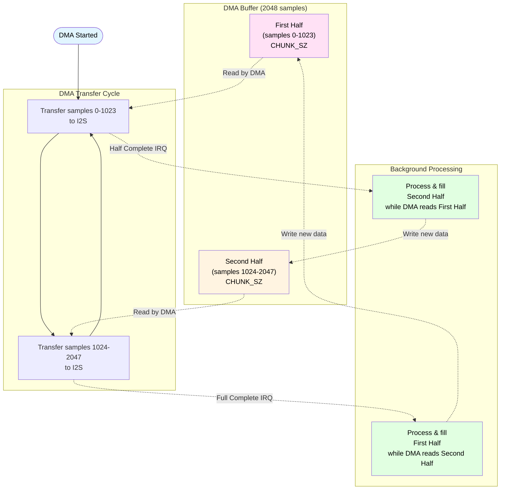

---

## 📖 How to View These Flowcharts

### In VS Code
1. Install the "Markdown Preview Mermaid Support" extension
2. Open this file and press `Ctrl+Shift+V` (or `Cmd+Shift+V` on Mac)
3. Flowcharts will render automatically

### On GitHub
GitHub natively renders Mermaid diagrams in markdown files. Just view this file on GitHub.

### In Other Tools
- **Mermaid Live Editor**: Copy diagram code to https://mermaid.live
- **Obsidian**: Renders Mermaid natively
- **Notion**: Supports Mermaid diagrams
- **GitLab**: Native Mermaid support
- **Docusaurus**: Native Mermaid support

## 🔗 Related Documentation

- [AUDIO_ENGINE_MANUAL.md](AUDIO_ENGINE_MANUAL.md) - Complete technical manual
- [API_REFERENCE.md](API_REFERENCE.md) - Function reference
- [QUICK_REFERENCE.md](QUICK_REFERENCE.md) - Common patterns
- [audio_engine.c](../Core/Libraries/audio_engine.c) - Implementation source code

---

*Last updated: 2026-02-01*
*Part of the Audio Engine Documentation Suite*
