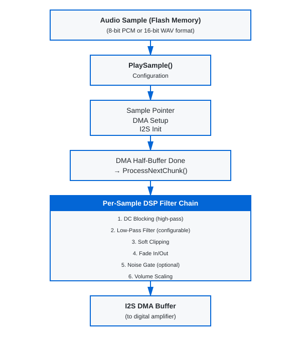

# Audio Engine User Manual

## Table of Contents

1. [Overview](#overview)
2. [Quick Start](#quick-start)
3. [Architecture](#architecture)
4. [API Reference](#api-reference)
5. [Filter Configuration](#filter-configuration)
6. [Playing Audio](#playing-audio)
7. [Filter Parameters & Tuning](#filter-parameters--tuning)
8. [Volume Control](#volume-control)
9. [Hardware Integration](#hardware-integration)
10. [Examples](#examples)
11. [Troubleshooting](#troubleshooting)
12. [Performance Notes](#performance-notes)

**📖 Complete API Reference:** See [API_REFERENCE.md](API_REFERENCE.md) for detailed documentation of all 60+ functions including getters, setters, and control functions.

---

## Overview

The Audio Engine is a reusable, embedded DSP audio playback system designed for GD32 microcontrollers with I2S support with audio output to digital amplifiers such as the MAX98357A.

### Key Features

- **Dual Format Support**: 8-bit and 16-bit audio playback
- **Flexible Modes**: Mono and stereo playback
- **DSP Filter Chain**: Runtime-configurable filters with fixed-point arithmetic
- **No FPU Required**: All DSP operations use integer math for MCU efficiency
- **Sample Rate**: Default 22 kHz (configurable)
- **DMA-Driven**: Efficient I2S streaming with double-buffering
- **Low Latency**: ~93 ms playback latency with 2048-sample buffer

### Core Capabilities

| Feature | Specification |
|---------|---------------|
| **Sample Rates** | 22 kHz (default), configurable |
| **Audio Depths** | 8-bit unsigned, 16-bit signed |
| **Channels** | Mono, Stereo |
| **Buffer Size** | 2048 samples (ping-pong DMA) |
| **Nyquist Frequency** | 11 kHz @ 22 kHz sample rate |
| **Volume Control** | Software configurable (0-3x gain) |
| **Fade Effects** | In/Out (~93 ms at 22 kHz) |

---

## Quick Start

### 1. Initialize the Audio Engine

You **must** call `AudioEngine_Init()` to set up the audio engine with the required hardware callbacks. This function initializes all filter state and validates that the necessary hardware interface functions are provided:

```c
#include "audio_engine.h"

// Step 1: I2S peripheral clock/pins must be initialized in application startup
// (Project uses spi_config(speed) as the I2S re-init callback)

// Step 2: Initialize the audio engine with hardware callbacks
PB_StatusTypeDef status = AudioEngine_Init(
  DAC_MasterSwitch,       // Function to control amplifier on/off
  ReadVolume,             // Function to read volume setting
  spi_config              // Function to re-initialize I2S for a requested sample rate
);

if( status != PB_Idle ) {
  // Handle initialization error
}

// Step 3: Configure filters (optional, defaults are pre-set)
SetLpf16BitLevel(LPF_Soft);                    // Set filter aggressiveness
SetFilterConfig(&my_filter_config);            // Apply complete config

// Audio engine is now ready to play samples
```

### 2. Play a 16-bit Audio Sample

```c
// Assuming 'doorbell_sound' is a 16-bit mono WAV sample in flash memory
// 44,100 samples = ~2 seconds @ 22 kHz, 16-bit mono

extern const uint8_t doorbell_sound[];
extern const uint32_t doorbell_sound_size;

PB_StatusTypeDef result = PlaySample(
  doorbell_sound,              // Pointer to audio data
  doorbell_sound_size,         // Total samples (all channels combined)
  22000,                       // Sample rate (Hz)
  16,                          // Bit depth (16 = 16-bit)
  Mode_stereo                  // Stereo playback
);

// Wait for playback to complete
WaitForSampleEnd();
```

### 3. Configure Filters

```c
// Get current filter configuration
FilterConfig_TypeDef cfg;
GetFilterConfig(&cfg);

// Adjust filter levels
cfg.enable_16bit_biquad_lpf = 1;      // Enable 16-bit LPF
cfg.enable_soft_clipping = 1;         // Enable soft clipping to prevent distortion
cfg.lpf_16bit_level = LPF_Medium;     // Medium filtering strength

// Apply new configuration
SetFilterConfig(&cfg);

// Or use convenience function for LPF level
SetLpf16BitLevel(LPF_Aggressive);     // Stronger filtering

// 8-bit path: set a custom LPF alpha and read it back
SetLpf8BitLevel(LPF_Custom);
SetLpf8BitCustomAlpha(CalcLpf8BitAlphaFromCutoff(900.0f, 11025.0f));
uint16_t current_alpha = GetLpf8BitCustomAlpha();
```

---

## Architecture

### System Block Diagram



The audio playback system follows a clear data flow from flash memory through DSP processing to the I2S output. The DMA operates in ping-pong mode, processing audio chunks as they're transmitted, ensuring continuous playback without CPU blocking.

### Filter Chain Stages (16-bit Audio)

1. **Biquad Low-Pass Filter** *(Optional - enable_16bit_biquad_lpf)*
   - Second-order IIR filter
    - Runtime-configurable aggressiveness: Very Soft → Aggressive
    - Warm-up: 16 passes of first sample to prevent startup artefacts
    - Cutoff range (22 kHz fs, approx): ~2.6 kHz (Very Soft), ~1.4 kHz (Soft), ~0.9 kHz (Medium), ~0.2 kHz (Aggressive)
    - 64-bit accumulator in the biquad path to prevent overflow with aggressive settings

2. **DC Blocking Filter** *(Selectable - enable_soft_dc_filter_16bit)*
   - Removes DC offset and very low frequencies
   - Two variants: standard (44 Hz) or soft (22 Hz)
   - Prevents output drift
   - Always active in one of the two modes

3. **Air Effect (High-Shelf)** *(Optional - enable_air_effect)*
   - Adds presence and brightness to audio
   - Runtime-adjustable boost (+1 dB, +2 dB, +3 dB presets)
   - Disabled by default

4. **Fade In/Out** *(Enabled by default)*
   - Quadratic power curve ramp
   - Default: 2048 samples (~93 ms @ 22 kHz)
   - Smooth entry/exit for audio transitions
  - Can be disabled via `SetFadersEnabled(0)` if needed

5. **Noise Gate** *(Optional - enable_noise_gate)*
   - Mutes samples below ±512 amplitude
   - Suppresses quantization noise during silence
   - Disabled by default

6. **Soft Clipping** *(Optional - enable_soft_clipping)*
   - Smooth cubic curve limiting above ±28,000
   - Prevents harsh digital clipping
   - Musical, natural-sounding compression
   - Recommended: keep enabled

7. **Volume Scaling** *(Always Active)*
   - Integer multiplication (0–3x gain)
   - Read from hardware GPIO (3-level selector)
   - Applied per-sample

### Filter Chain Stages (8-bit Audio)

1. **8-bit to 16-bit Conversion with Dithering** *(Always Active)*
   - TPDF (Triangular PDF) dithering reduces quantization noise
   - Upsamples to internal 16-bit working format

2. **One-Pole Low-Pass Filter** *(Optional - enable_8bit_lpf)*
  - One-pole IIR (alpha range: 0.625 to 0.9375)
  - Separate aggressiveness levels for 8-bit audio
  - Custom alpha supported via `SetLpf8BitCustomAlpha()` and `CalcLpf8BitAlphaFromCutoff()`
  - Current custom alpha can be read with `GetLpf8BitCustomAlpha()`

3. **Makeup Gain** *(Always Active when LPF enabled)*
   - Post-LPF amplitude compensation (~1.08x default)
   - Configurable via `SetLpfMakeupGain8Bit()`

4. **DC Blocking & Remaining Stages**
   - Same as 16-bit path (steps 2–7)
   - Air Effect, Fade, Noise Gate, Soft Clipping, Volume Scaling

---

## API Reference

### Enumeration Types

#### `PB_StatusTypeDef`
Audio playback state enumeration.

```c
typedef enum {
  PB_Idle,           // No audio playing
  PB_Error,          // Error during playback
  PB_Playing,        // Audio actively playing
  PB_Pausing,        // Fade-out in progress (pause or stop)
  PB_Paused,         // Playback paused
  PB_PlayingFailed   // Playback failed to start
} PB_StatusTypeDef;
```

#### `PB_ModeTypeDef`
Playback channel mode.

```c
typedef enum {
  Mode_stereo,       // Stereo (2-channel) playback
  Mode_mono          // Mono (single-channel) playback
} PB_ModeTypeDef;
```

#### `LPF_Level`
Low-pass filter aggressiveness level for 16-bit and 8-bit LPFs.

```c
typedef enum {
  LPF_Off,           // Filtering disabled
  LPF_VerySoft,      // Minimal filtering (α = 0.625)
  LPF_Soft,          // Gentle filtering (α ≈ 0.80)
  LPF_Medium,        // Balanced filtering (α = 0.875)
  LPF_Firm,          // Firm filtering (α ≈ 0.92)
  LPF_Aggressive,    // Strong filtering (α ≈ 0.97)
  LPF_Custom         // Use custom alpha (SetLpf16BitCustomAlpha or SetLpf8BitCustomAlpha)
} LPF_Level;
```

### Structure Types

#### `FilterConfig_TypeDef`
Runtime filter configuration structure.

```c
typedef struct {
  uint8_t enable_16bit_biquad_lpf;  // Enable/disable 16-bit biquad LPF
  uint8_t enable_soft_dc_filter_16bit;  // Use softer DC blocking (22 Hz vs 44 Hz)
  uint8_t enable_8bit_lpf;          // Enable/disable 8-bit one-pole LPF
  uint8_t enable_noise_gate;        // Enable/disable noise gate
  uint8_t enable_soft_clipping;     // Enable/disable soft clipping
  uint8_t enable_air_effect;        // Enable/disable air effect
  uint32_t lpf_makeup_gain_q16;     // Post-LPF gain in Q16 fixed-point
  uint32_t lpf_makeup_gain_16bit_q16;  // Post-16-bit LPF gain in Q16 fixed-point
  LPF_Level lpf_16bit_level;        // 16-bit LPF aggressiveness
  uint16_t lpf_16bit_custom_alpha;  // Custom alpha for 16-bit LPF
  LPF_Level lpf_8bit_level;         // 8-bit LPF aggressiveness
  uint16_t lpf_8bit_custom_alpha;   // Custom alpha for 8-bit LPF
  uint8_t enable_filter_chain_16bit;  // Master enable for entire 16-bit filter chain
  uint8_t enable_filter_chain_8bit;   // Master enable for entire 8-bit filter chain
} FilterConfig_TypeDef;
```

**Field Descriptions:**
- `lpf_makeup_gain_q16`: Gain value in Q16 format (65536 = 1.0x). Default: 70779 (~1.08x)
- `lpf_16bit_level`: Filter aggressiveness affects cutoff frequency and stop-band attenuation
- `lpf_16bit_custom_alpha`: Custom alpha used when `lpf_16bit_level = LPF_Custom`
- `lpf_8bit_level`: Filter aggressiveness for the 8-bit one-pole LPF
- `lpf_8bit_custom_alpha`: Custom alpha used when `lpf_8bit_level = LPF_Custom`

#### `AudioEngine_HandleTypeDef`
Audio engine state handle (for initialization).

```c
typedef struct {
  void *i2s_context;         // Optional application-specific I2S context pointer
  int16_t *pb_buffer;        // Playback buffer (2048 samples)
  uint32_t playback_speed;   // Default playback speed (Hz)
} AudioEngine_HandleTypeDef;
```

### Function Reference

#### Hardware Setup (Done in main.c)

Before playing audio, ensure:
1. **I2S is configured** in application startup code (22 kHz, 16-bit, DMA enabled)
2. **`AudioEngine_Init()` is called** with function pointers for:
   - DAC on/off control
   - Volume reading
   - I2S re-initialization
3. **Filters are configured** to desired settings (optional; defaults are applied by `AudioEngine_Init()`)

Calling `AudioEngine_Init()` is **required** before any audio playback. It initializes the filter state, validates hardware callbacks, and sets up default filter configuration.

#### Playback Control

##### `AudioEngine_Init()`
Initialize the audio engine with required hardware callbacks.

```c
PB_StatusTypeDef AudioEngine_Init(
  DAC_SwitchFunc dac_switch,
  ReadVolumeFunc read_volume,
  I2S_InitFunc i2s_init
);
```

**Parameters:**
- `dac_switch`: Function pointer for controlling amplifier on/off (GPIO control)
- `read_volume`: Function pointer for reading current volume level
- `i2s_init`: Function pointer for I2S peripheral re-initialization

**Returns:**
- `PB_Idle` if initialization successful
- `PB_Error` if any function pointer is NULL

**Important Notes:**
- **Must be called once** before any call to `PlaySample()` or other playback functions
- Initializes all filter state variables and resets playback status
- Sets up default filter configuration (can be overridden with `SetFilterConfig()`)
- Validates that all required hardware callbacks are provided
- Does not start audio playback itself

**Example:**
```c
#include "audio_engine.h"

// Define these functions in your application
void DAC_MasterSwitch(uint8_t state) {
  if (state) {
    gpio_bit_write(GPIOC, GPIO_PIN_0, SET);    // Enable amplifier
  } else {
    gpio_bit_write(GPIOC, GPIO_PIN_0, RESET);  // Disable amplifier
  }
}

uint16_t ReadVolume(void) {
  // Return volume level 1-65535
  return volume_setting;
}

// In main.c initialization:
PB_StatusTypeDef status = AudioEngine_Init(
  DAC_MasterSwitch,
  ReadVolume,
  spi_config
);

if (status != PB_Idle) {
  printf("Audio engine initialization failed!\n");
  return;
}

// Now safe to call PlaySample()
```

##### `PlaySample()`
Start playback of an audio sample.

```c
PB_StatusTypeDef PlaySample(
  const void *sample_to_play,
  uint32_t sample_set_sz,
  uint32_t playback_speed,
  uint8_t sample_depth,
  PB_ModeTypeDef mode
);
```

**Parameters:**
- `sample_to_play`: Pointer to audio data in flash/RAM
- `sample_set_sz`: Total samples (all channels combined)
- `playback_speed`: Sample rate in Hz (typically 22000)
- `sample_depth`: 8 or 16 (bits per sample)
- `mode`: `Mode_mono` or `Mode_stereo`

**Returns:**
- `PB_Playing` if playback started successfully
- `PB_Error` or `PB_PlayingFailed` on error

**Important Notes:**
- Audio data is accessed in real-time during playback (must be in accessible memory)
- DMA directly reads from the provided buffer
- For 16-bit mono audio: `sample_set_sz = num_samples`
- For 16-bit stereo (interleaved): `sample_set_sz = 2 * num_frames`
- For 8-bit mono audio: `sample_set_sz = num_samples`
- For 8-bit stereo (interleaved): `sample_set_sz = 2 * num_frames`
- Blocks briefly while starting DMA
- Configure filters separately with `SetLpf16BitLevel()` or `SetFilterConfig()`

**Example:**
```c
extern const uint8_t alert_sound_16bit_mono[];
extern const uint32_t alert_sound_16bit_mono_size;

SetLpf16BitLevel(LPF_Medium);  // Medium filtering

PB_StatusTypeDef result = PlaySample(
  alert_sound_16bit_mono,
  alert_sound_16bit_mono_size,
  22000,      // Sample rate
  16,         // 16-bit
  Mode_mono
);

if (result != PB_Playing) {
  // Handle error
  printf("Playback failed: %d\n", result);
}
```

##### `WaitForSampleEnd()`
Block until audio playback completes.

```c
PB_StatusTypeDef WaitForSampleEnd(void);
```

**Returns:**
- `PB_Idle` when playback finishes
- `PB_Error` if playback was interrupted

**Example:**
```c
SetLpf16BitLevel(LPF_Soft);
PlaySample(my_sound, my_sound_size, 22000, 16, Mode_mono);
WaitForSampleEnd();  // Wait until done
printf("Playback complete\n");
```

##### `PausePlayback()`
Pause ongoing playback (can resume later) with smooth fade-out.

```c
PB_StatusTypeDef PausePlayback(void);
```

**Returns:**
- `PB_Paused` on success
- `PB_Idle` if no audio was playing

**Notes:**
- Pause fadeout duration set by `SetPauseFadeTime()`
- Intelligently handles edge cases to prevent audible artefacts:
  - **Pausing during fade-in:** Scales pause fadeout proportionally to start from current volume
  - **Pausing during end-of-file fadeout:** Scales pause fadeout to maintain smooth volume continuity
- All transitions use quadratic volume curves for smooth audio

**Example:**
```c
if (user_pressed_pause_button) {
  PausePlayback();
}
```

##### `ResumePlayback()`
Resume previously paused audio with smooth fade-in.

```c
PB_StatusTypeDef ResumePlayback(void);
```

**Returns:**
- `PB_Playing` on success
- `PB_Idle` if no paused audio

**Notes:**
- Resume fadein duration set by `SetResumeFadeTime()`
- Audio fades in smoothly from silence using a quadratic volume curve
- Playback resumes from the exact position where it was paused

**Example:**
```c
if (user_pressed_play_button && prev_state == PB_Paused) {
  ResumePlayback();
}
```

---

#### Filter Configuration

##### `SetFilterConfig()`
Apply a complete filter configuration.

```c
void SetFilterConfig(const FilterConfig_TypeDef *cfg);
```

**Parameters:**
- `cfg`: Pointer to filter configuration structure

**Example:**
```c
FilterConfig_TypeDef cfg = {
  .enable_16bit_biquad_lpf = 1,
  .enable_soft_dc_filter_16bit = 1,
  .enable_8bit_lpf = 1,
  .enable_noise_gate = 0,
  .enable_soft_clipping = 1,
  .enable_air_effect = 0,
  .lpf_makeup_gain_q16 = 70779,
  .lpf_16bit_level = LPF_Medium,
  .lpf_16bit_custom_alpha = LPF_16BIT_MEDIUM,
  .lpf_8bit_level = LPF_Medium,
  .lpf_8bit_custom_alpha = LPF_MEDIUM
};
SetFilterConfig(&cfg);
```

##### `GetFilterConfig()`
Read current filter configuration.

```c
void GetFilterConfig(FilterConfig_TypeDef *cfg);
```

**Example:**
```c
FilterConfig_TypeDef cfg;
GetFilterConfig(&cfg);
printf("LPF Level: %d\n", cfg.lpf_16bit_level);
```

##### `SetLpf16BitLevel()`
Change 16-bit LPF aggressiveness (convenience function).

```c
void SetLpf16BitLevel(LPF_Level level);
```

**Parameters:**
- `level`: LPF_VerySoft, LPF_Soft, LPF_Medium, LPF_Firm, or LPF_Aggressive

**Example:**
```c
SetLpf16BitLevel(LPF_Aggressive);  // Strong filtering
```

##### `SetLpf8BitCustomAlpha()`
Set custom alpha for the 8-bit one-pole LPF.

```c
void SetLpf8BitCustomAlpha(uint16_t alpha);
```

**Example:**
```c
SetLpf8BitLevel(LPF_Custom);
SetLpf8BitCustomAlpha(LPF_MEDIUM);
```

##### `GetLpf8BitCustomAlpha()`
Read the current 8-bit LPF custom alpha value.

```c
uint16_t GetLpf8BitCustomAlpha(void);
```

##### `CalcLpf8BitAlphaFromCutoff()`
Compute 8-bit LPF alpha from cutoff and sample rate.

```c
uint16_t CalcLpf8BitAlphaFromCutoff(float cutoff_hz, float sample_rate_hz);
```

**Example:**
```c
uint16_t alpha = CalcLpf8BitAlphaFromCutoff(4500.0f, 11000.0f);
SetLpf8BitLevel(LPF_Custom);
SetLpf8BitCustomAlpha(alpha);
```

##### `SetLpfMakeupGain8Bit()`
Set post-LPF gain for 8-bit audio.

```c
void SetLpfMakeupGain8Bit(float gain);
```

**Parameters:**
- `gain`: Gain multiplier (e.g., 1.0 = no change, 1.08 = +8%)

**Example:**
```c
SetLpfMakeupGain8Bit(1.15f);  // Boost 8-bit audio by 15%
```

---

#### Status Accessors

##### `GetPlaybackState()`
Query current playback state (for non-blocking polling).

```c
uint8_t GetPlaybackState(void);
```

**Returns:**
- `PB_Idle`, `PB_Playing`, `PB_Paused`, etc.

**Example:**
```c
if (GetPlaybackState() == PB_Playing) {
  printf("Audio is playing...\n");
}
```

##### `GetPlaybackSpeed()`
Get current sample rate.

```c
uint32_t GetPlaybackSpeed(void);
```

---

### Hardware Integration Functions

These must be defined by the application to integrate the audio engine with your specific hardware.

#### `AudioEngine_DACSwitch()`
Function pointer to control amplifier GPIO (on/off).

```c
extern DAC_SwitchFunc AudioEngine_DACSwitch;

// Application must define:
void MyDACControl(GPIO_PinState setting) {
  if (setting == SET) {
    gpio_bit_write(AMP_EN_GPIO_Port, AMP_EN_Pin, SET);    // ON
  } else {
    gpio_bit_write(AMP_EN_GPIO_Port, AMP_EN_Pin, RESET);  // OFF
  }
}

// In initialization:
AudioEngine_DACSwitch = MyDACControl;
```

#### `AudioEngine_ReadVolume()`
Function pointer to read volume setting (0–65535). Raw values are scaled as gain during playback. 0 is treated as 1 for minimum volume. Values are subject to the configured volume response curve (linear by default, or non-linear gamma curve if enabled).

```c
extern ReadVolumeFunc AudioEngine_ReadVolume;

// Application must define:
uint16_t MyReadVolume(void) {
  // Read GPIO pins or ADC to determine volume level (0–65535)
  uint16_t volume = ReadMyVolumeSource();
  return volume ? volume : 1;  // Treat 0 as 1 for minimum volume
}

// In initialization:
AudioEngine_ReadVolume = MyReadVolume;

// Optionally configure volume response curve:
SetVolumeResponseNonlinear(1);      // Enable non-linear response (default)
SetVolumeResponseGamma(2.0f);       // Set gamma exponent (1.0–4.0)
```

#### `AudioEngine_I2SInit()`
Function pointer to re-initialize I2S if needed (called after pause/resume).

```c
extern I2S_InitFunc AudioEngine_I2SInit;

// Application must define:
void MyI2Init(void) {
  My_I2S_Init_code();
}

// In initialization:
AudioEngine_I2SInit = MyI2SInit;
```

#### DMA Callbacks

Connect these to your I2S DMA interrupt handlers:

```c
// In your I2S interrupt service routine:
void I2S_TxHalfCpltCallback( void ) {
  // Called when first half of DMA buffer is transmitted
  // Audio engine processes next chunk
}

void I2S_TxCpltCallback( void ) {
  // Called when second half of DMA buffer is transmitted
}
```

The audio engine provides these implementations that will be called automatically.

## Filter Configuration

### 16-bit LPF Aggressiveness Levels

The 16-bit biquad uses **lower α for heavier filtering** (same direction as the 8-bit one-pole). The coefficient formula `b0 = ((65536 - alpha) * (65536 - alpha)) >> 17` means lower alpha values result in more aggressive low-pass filtering.

| Level | Alpha | Notes |
|-------|-------|-------|
| **Very Soft** | 0.625 | Minimal filtering / brightest tone / highest cutoff |
| **Soft** | ~0.80 | Gentle filtering |
| **Medium** | 0.875 | Balanced filtering |
| **Firm** | ~0.92 | Firm filtering / lower cutoff |
| **Aggressive** | ~0.97 | Strongest filtering / darkest tone / lowest cutoff |

- Warm-up (16 passes) still runs to suppress startup artefacts at the most aggressive setting.

**Recommended Input Range for Best Quality:**

The 16-bit biquad has feedback that can cause overshoot and ringing, especially at aggressive filter levels. To avoid clipping while preserving dynamic range:

| Level | Recommended Range | Notes |
|-------|-------------------|-------|
| **LPF_VerySoft** | 75–85% of full scale (±24,500 to ±27,750) | Minimal overshoot risk |
| **LPF_Soft** | 70–80% of full scale (±22,937 to ±26,214) | Good balance (recommended) |
| **LPF_Medium** | 70–75% of full scale (±22,937 to ±24,500) | Increasing feedback |
| **LPF_Firm** | 65–75% of full scale (+/-21,300 to +/-24,500) | Stronger feedback; moderate headroom |
| **LPF_Aggressive** | 60–70% of full scale (±19,660 to ±22,937) | Strong feedback; conservative headroom essential |

**General Guideline:**  
Use **70–80% of full scale (±23,000)** as a safe starting point. If using LPF_Aggressive, stay closer to 70%; if using LPF_VerySoft, you can push toward 80–85%.

### 8-bit LPF Aggressiveness Levels

8-bit audio uses a **first-order (one-pole) filter** rather than a biquad. This architecture avoids feedback loop instability on quantized 8-bit data. As a result, the alpha range is narrower than the 16-bit biquad to maintain filter stability.

**Filter Architecture:**
- **One-pole formula**: `output = (α × input + (1 − α) × prev_output) × makeup_gain`
- **Why narrower range**: One-pole filters at low alpha (high filtering) can amplify quantization noise; biquads are more robust to this.

| Level | Alpha | Cutoff Freq |
|-------|-------|------------|
| **Very Soft** | 0.9375 | ~3200 Hz |
| **Soft** | 0.875 | ~2800 Hz |
| **Medium** | 0.75 | ~2300 Hz |
| **Firm** | 0.6875 | ~2000 Hz |
| **Aggressive** | 0.625 | ~1800 Hz |

**Note on Range Differences:**  
The 16-bit biquad (α: 0.625 → 0.97) and 8-bit one-pole (α: 0.625 → 0.9375) do *not* span the same range. This is intentional: the biquad's wider range is safe for 16-bit data, while the one-pole's narrower range prevents instability on 8-bit input. Both filters provide LPF_VerySoft, LPF_Soft, LPF_Medium, LPF_Firm, and LPF_Aggressive presets for user consistency, but their underlying coefficients differ.

**Important:** The two filter types have the **same relationship** between alpha and filtering: **lower alpha = more filtering** for both architectures. The biquad coefficient formula uses `(65536 - alpha)`, which inverts the typical relationship.

### DC Blocking Filter

Removes DC offset and very low frequencies.

| Variant | Alpha | Cutoff Freq | Use |
|---------|-------|------------|-----|
| **Standard** | 0.98 | ~44 Hz | Normal playback |
| **Soft** | 0.995 | ~22 Hz | Gentler high-pass (use if ultra-low audio needed) |

**When to Enable `enable_soft_dc_filter_16bit`:**
- Music with extended bass (< 44 Hz content)
- Subwoofer testing
- Normally leave disabled for typical speech/alerts

### Soft Clipping Threshold

Soft clipping prevents harsh digital distortion when audio peaks exceed a threshold.

**Configuration:**
- **Threshold**: ±28,000 (85% of ±32,767 full scale)
- **Curve**: Cubic smoothstep (s(x) = 3x² - 2x³)
- **Benefit**: Musical, transparent limiting

**When to Enable:**
- Always recommended (prevents clipping artefacts)
- Disable only if maximum undistorted headroom needed

### Air Effect (High-Shelf Brightening Filter)

The Air Effect is an optional high-shelf filter that adds presence and brightness to audio by boosting high-frequency content. It uses a simple one-pole shelving architecture for CPU efficiency.

**Configuration (defaults):**
- **Type**: High-shelf one-pole filter
- **Shelf Gain (Q16)**: 98304 (~1.5×, ≈ +1.6 dB at Nyquist for α=0.75)
- **Shelf Gain Max (Q16)**: 131072 (2.0× cap to avoid harshness)
- **Cutoff Alpha**: 0.75 (~5–6 kHz shelving frequency @ 22 kHz)
- **Default State**: Disabled (`enable_air_effect = 0`)

**Runtime Control (dB or Q16):**
- `SetAirEffectGainDb(float db)`: set target HF boost in dB (computes Q16 internally, clamped to max)
- `GetAirEffectGainDb(void)`: read current boost in dB
- `SetAirEffectGainQ16(uint32_t gain_q16)`: set raw Q16 shelf gain (clamped)
- `GetAirEffectGainQ16(void)`: read raw Q16 shelf gain
- Presets (built-in): `{+1 dB, +2 dB, +3 dB}` with helpers:
  - `SetAirEffectPresetDb(uint8_t preset_index)`
  - `CycleAirEffectPresetDb(void)`
  - `GetAirEffectPresetIndex/Count/GetAirEffectPresetDb`

**Filter Characteristics:**
The Air Effect works by separating high-frequency content and amplifying it:

1. Extract high-frequency component: `high_freq = input - prev_input`
2. Amplify high frequencies: `boost = high_freq × (1 − α) × shelf_gain`
3. Blend with smoothed output: `output = (α × input) + ((1 − α) × prev_output) + boost`

**When to Enable:**
- Muffled or dark-sounding samples → adds clarity and presence
- Quiet samples → adds energy and perceived loudness
- Archived audio → brightens aged or compressed recordings
- **Do not enable** if audio already sounds bright or harsh (risk of harshness)

**Typical Use Case:**

```c
// Enable Air Effect and choose +2 dB preset
SetAirEffectPresetDb(2); // preset 0=off, 1=+1dB, 2=+2dB, 3=+3dB
// (Auto-disables if preset=0, auto-enables if preset>0)
SetLpf16BitLevel(LPF_Soft);

PlaySample(
  muffled_doorbell,
  sample_size,
  22000,
  16,
  Mode_mono
);

// Adjust live (e.g., button/UART):
CycleAirEffectPresetDb();
```

**Filter Chain Order:**

The Air Effect is positioned after the DC blocking filter but before fade/clipping effects:

```c
16/8-bit LPF (optional: enable_16bit_biquad_lpf / enable_8bit_lpf)
  ↓
DC Blocking Filter (always on: standard or soft mode)
  ↓
AIR EFFECT (optional: enable_air_effect)
  ↓
Fade In/Out (always active)
  ↓
Noise Gate (optional: enable_noise_gate)
  ↓
Soft Clipping (optional: enable_soft_clipping, recommended)
  ↓
Volume Scaling (always active)
```

**Tuning the Effect:**

- For subtle brightening: use `SetAirEffectGainDb(1.0f)` or `SetAirEffectPresetDb(1)` (+1 dB).
- For more sparkle: use `SetAirEffectGainDb(2.0f)` or `SetAirEffectPresetDb(2)` (+2 dB).
- For stronger presence: `SetAirEffectGainDb(3.0f)` or preset 3 (+3 dB).
- For a subtle lift: `SetAirEffectGainDb(0.0f)` (flat) or reduce gain below 0 dB if adding presence elsewhere.
- For different sample rates (e.g., 48 kHz), raise `AIR_EFFECT_CUTOFF` (higher α) to keep the shelf in the upper band.

---

## Playing Audio

### Basic Playback Workflow

```c
#include "audio_engine.h"

// 1. Startup (once during initialization, e.g., in main.c)
static void AudioEngine_Init(void) {
  // Wire hardware hooks
  AudioEngine_DACSwitch  = DAC_MasterSwitch;
  AudioEngine_ReadVolume = ReadVolume;
  AudioEngine_I2SInit    = spi_config;

  // Configure filters
  FilterConfig_TypeDef cfg = filter_cfg; // start from defaults
  cfg.enable_16bit_biquad_lpf      = 0;
  cfg.enable_8bit_lpf              = 1;
  cfg.enable_soft_dc_filter_16bit  = 0;
  cfg.enable_soft_clipping         = 1;
  SetFilterConfig(&cfg);

  // Optional tuning
  SetLpf16BitLevel(LPF_Soft);
  SetAirEffectPresetDb(2); // +2 dB preset (auto-enables air effect)
}

// 2. Play an audio sample
static void PlayAlert(void) {
  extern const uint8_t alert_16bit_mono[];
  extern const uint32_t alert_16bit_mono_size;
  
  PB_StatusTypeDef result = PlaySample(
    alert_16bit_mono,
    alert_16bit_mono_size,
    22000,           // Sample rate
    16,              // 16-bit depth
    Mode_mono        // Mono playback
  );
  
  if (result == PB_Playing) {
    WaitForSampleEnd();
  }
}

// 3. Non-blocking playback
static void PlayAlertNonBlocking(void) {
  PlaySample(alert_16bit_mono, alert_16bit_mono_size, 22000, 16, Mode_mono);
  // Returns immediately; playback happens in background
}

static void CheckPlaybackStatus(void) {
  if (GetPlaybackState() == PB_Playing) {
    printf("Still playing...\n");
  } else {
    printf("Playback finished\n");
  }
}
```

### Multi-Sample Playback Sequence

```c
void PlayDoorbell(void) {
  // First: chime sound (16-bit, gentle filtering)
  SetLpf16BitLevel(LPF_Soft);
  PlaySample(chime_16bit, chime_size, 22000, 16, Mode_mono);
  WaitForSampleEnd();
  
  // Small delay between sounds
  delay_ms(500);
  
  // Second: bell sound (16-bit, medium filtering)
  SetLpf16BitLevel(LPF_Medium);
  PlaySample(bell_16bit, bell_size, 22000, 16, Mode_mono);
  WaitForSampleEnd();
  
  printf("Doorbell sequence complete\n");
}
```

### Adjusting Playback on the Fly

```c
void InteractivePlayback(void) {
  // Start playback with default settings
  SetLpf16BitLevel(LPF_Medium);
  PlaySample(my_audio, my_audio_size, 22000, 16, Mode_mono);
  
  while (GetPlaybackState() == PB_Playing) {
    // Monitor user input
    if (user_pressed_filter_button) {
      // Change filter level mid-playback
      SetLpf16BitLevel(LPF_Aggressive);
    }
    
    if (user_pressed_pause_button) {
      PausePlayback();
    }
    
    if (user_pressed_resume_button) {
      ResumePlayback();
    }
    
    delay_ms(100);
  }
}
```

---

## Filter Parameters & Tuning

### Understanding Alpha Coefficients

All filters in the audio engine use first-order or second-order IIR (infinite impulse response) filters with feedback coefficient **α (alpha)**.

**First-Order Filter:**
```c
y[n] = α · x[n-1] + (1 - α) · y[n-1]
```

- α close to 1.0: Less filtering (high frequencies pass through)
- α close to 0.0: More filtering (stronger attenuation)

**Biquad (Second-Order) Filter:**
```c
y[n] = b0·x[n] + b1·x[n-1] + b2·x[n-2] - a1·y[n-1] - a2·y[n-2]
```

Where coefficients are derived from α:
- b0 = ((1 - α)² ) / 2
- b1 = 2 · b0
- b2 = b0
- a1 = -2 · α
- a2 = α²

### Warm-Up Behavior

**Problem:** With aggressive filtering (α = 0.625), the first playback sample causes a brief "cracking" sound due to the filter initializing from zero state.

**Solution:** **Configurable Warm-Up (Default: 16 passes)**
- Automatically invoked when playing 16-bit audio with enabled LPF
- Feeds the first audio sample through the biquad filter `BIQUAD_WARMUP_CYCLES` times on each channel (default: 16)
- Allows filter state to converge smoothly before DMA streaming starts
- Result: Eliminates startup transient artefacts

**Configuration:**
The warm-up behavior can be adjusted by changing the `BIQUAD_WARMUP_CYCLES` define in `audio_engine.h`:
```c
#define BIQUAD_WARMUP_CYCLES  16  // Default: 16 passes (was 8)
```

**Code Example (from audio_engine.c):**
```c
if (sample_depth == 16 && filter_cfg.enable_16bit_biquad_lpf) {
  int16_t first_sample = *((int16_t *)sample_to_play);
  // Run BIQUAD_WARMUP_CYCLES passes to let filter state settle
  for (uint8_t i = 0; i < BIQUAD_WARMUP_CYCLES; i++) {
    ApplyLowPassFilter16Bit(first_sample, 
      &lpf_16bit_x1_left, &lpf_16bit_x2_left,
      &lpf_16bit_y1_left, &lpf_16bit_y2_left);
    ApplyLowPassFilter16Bit(first_sample,
      &lpf_16bit_x1_right, &lpf_16bit_x2_right,
      &lpf_16bit_y1_right, &lpf_16bit_y2_right);
  }
}
```

### Q16 Fixed-Point Arithmetic

All filter coefficients and gains use **Q16 fixed-point representation**:

```c
Q16 Value = Integer Value × 65536
Example: 1.0 = 65536 (0x10000)
     0.5 = 32768 (0x8000)
     1.08 ≈ 70779
```

**Advantages:**
- No floating-point hardware required (faster on MCU)
- Deterministic, no rounding surprises
- Easy to implement in assembly if needed

**Converting Gain to Q16:**
```c
float gain = 1.08;
uint32_t gain_q16 = (uint32_t)(gain * 65536.0f);  // 70779
SetLpfMakeupGain8Bit(gain);  // Convenience function
```

### Tuning Guide

#### For Speech/Alert Sounds
```c
FilterConfig_TypeDef cfg = {
  .enable_16bit_biquad_lpf = 1,
  .enable_soft_dc_filter_16bit = 0,  // Not needed for speech
  .enable_8bit_lpf = 1,
  .enable_noise_gate = 0,             // Or 1 if background noise
  .enable_soft_clipping = 1,
  .lpf_makeup_gain_q16 = 70779,       // 1.08x
  .lpf_16bit_level = LPF_Soft         // Gentle, preserve clarity
};
SetFilterConfig(&cfg);
```

#### For Bass-Heavy Music
```c
FilterConfig_TypeDef cfg = {
  .enable_16bit_biquad_lpf = 1,
  .enable_soft_dc_filter_16bit = 1,  // Preserve low bass
  .enable_8bit_lpf = 1,
  .enable_noise_gate = 0,
  .enable_soft_clipping = 1,
  .lpf_makeup_gain_q16 = 65536,       // 1.0x (no boost)
  .lpf_16bit_level = LPF_VerySoft     // Minimal filtering
};
SetFilterConfig(&cfg);
```

#### For Noisy Environments
```c
FilterConfig_TypeDef cfg = {
  .enable_16bit_biquad_lpf = 1,
  .enable_soft_dc_filter_16bit = 0,
  .enable_8bit_lpf = 1,
  .enable_noise_gate = 1,             // Suppress low-level noise
  .enable_soft_clipping = 1,
  .lpf_makeup_gain_q16 = 70779,
  .lpf_16bit_level = LPF_Medium       // Balanced noise reduction
};
SetFilterConfig(&cfg);
```

---

## Volume Control

### Overview

The audio engine applies volume scaling during sample processing. **Your application provides the volume input** by implementing a custom `ReadVolume()` function that returns a uint16_t value in the range 1–65535.

You can implement this function using various input methods:
- **Digital GPIO inputs** (OPT1–OPT3 pins for 3-bit binary encoding) — example pattern provided below
- **Analog ADC input** (12-bit potentiometer or variable resistance) — example pattern provided below
- **Other methods** (CAN bus, UART commands, network, etc.) — follow the same scaling approach

All implementations support **non-linear (logarithmic) volume response** to match human hearing perception.

### Non-Linear Volume Response

Human hearing perceives loudness logarithmically, not linearly. The audio engine provides a configurable gamma-curve response.

**Enable in main.h:**
```c
#define VOLUME_RESPONSE_NONLINEAR    // Enable non-linear curve
#define VOLUME_RESPONSE_GAMMA 2.0f   // Gamma exponent (typical value)
```

**How it works:**
- Linear input (1–65535) is normalized to 0.0–1.0
- Gamma curve is applied: `output = input^(1/gamma)`
- Result scales back to 1–65535 for audio attenuation

**Gamma Values:**
| Gamma | Perception | Use Case |
|-------|-----------|----------|
| **1.0** | Linear | Reference (no curve) |
| **2.0** | Quadratic (recommended) | Most intuitive for human control |
| **2.5** | Stronger curve | Aggressive low-volume response |

With **gamma = 2.0** (quadratic):
- **Low volumes** (0–50%): Small slider movement → big loudness change
- **High volumes** (50–100%): Big slider movement → small loudness change
- Result: More intuitive volume "feel" matching human perception

**To disable and use linear scaling:**
```c
//#define VOLUME_RESPONSE_NONLINEAR   // Comment this out
```

## Volume Control Implementation

> **Note:** Volume input implementation is application-specific. The audio engine simply invokes the `ReadVolume()` callback and expects a uint16_t value in the range 1–65535. The application is responsible for:
> - Choosing the volume input method (digital GPIO, ADC potentiometer, CAN bus, UART command, etc.)
> - Scaling that input to the 1–65535 range
> - Handling debouncing, hysteresis, or other input conditioning
> - Being aware that if `VOLUME_RESPONSE_NONLINEAR` is enabled, the engine applies a gamma curve to the returned value

### Application Example: Digital GPIO Volume Control

**3-bit binary selector example (shows the pattern for application developers):**

| Selection | Binary | Scaled to 1–65535 |
|-----------|--------|------------------|
| Maximum | 0b000 | 65535 |
| 75% | 0b001 | 49151 |
| 50% | 0b010 | 32767 |
| ... | ... | ... |
| Minimum | 0b111 | 1 |

**Example implementation in application (main.c):**
```c
uint16_t ReadVolume(void) {
  // Application reads three GPIO pins for volume
  uint8_t v =
    ( ( (OPT3_GPIO_Port->IDR & OPT3_Pin) != 0 ) << 2 ) |
    ( ( (OPT2_GPIO_Port->IDR & OPT2_Pin) != 0 ) << 1 ) |
    ( ( (OPT1_GPIO_Port->IDR & OPT1_Pin) != 0 ) << 0 );

  v = 7 - v;  // Invert so 0b000 = max volume
  uint32_t scaled = ( (uint32_t)v * 65535U ) / 7U;  // Map 0–7 to 1–65535
  return (uint16_t)scaled;
}
```

### Application Example: Analog ADC Volume Control

**Potentiometer example (shows the pattern for application developers):**

**Example implementation in application (main.c):**
```c
uint16_t ReadVolume(void) {
  // Application reads 12-bit ADC (0–4095)
  // Scale to 1–65535 range
  uint32_t lin = ((uint32_t)adc_raw * 65535U) / 4095U;
  return (uint16_t)lin;
}

void ADC0_1_IRQHandler( void )
{
  if( SET == adc_interrupt_flag_get(ADC1, ADC_INT_FLAG_EOC) ) {
    adc_interrupt_flag_clear(ADC1, ADC_INT_FLAG_EOC);
    adc_raw = adc_regular_data_read(ADC1);
  }
}
```

---

## Hardware Integration

### Application Integration Template

```c
#include "audio_engine.h"
#include <gd32f30x.h>

/* Hardware control functions (application-specific) */
void DAC_MasterSwitch(GPIO_PinState setting) {
  gpio_bit_write(AMP_EN_GPIO_Port, AMP_EN_Pin, setting);
}

uint16_t ReadVolume(void) {
  // Application-specific: read volume from GPIO, ADC, UART, etc.
  // Must return 1–65535 (0 is treated as 1)
  // The audio engine applies non-linear response if enabled
  
  // Example: 3-bit GPIO selector
  uint8_t v =
    ( ( (OPT3_GPIO_Port->IDR & OPT3_Pin) != 0 ) << 2 ) |
    ( ( (OPT2_GPIO_Port->IDR & OPT2_Pin) != 0 ) << 1 ) |
    ( ( (OPT1_GPIO_Port->IDR & OPT1_Pin) != 0 ) << 0 );
  v = 7 - v;  // Invert: 0b000 = max volume
  uint32_t scaled = ( (uint32_t)v * 65535U ) / 7U;
  return (uint16_t)scaled;
}

/* Main initialization (in main.c startup sequence) */
void SystemInit_Audio(void) {
  // Set hardware callbacks before playing audio
  AudioEngine_DACSwitch = DAC_MasterSwitch;
  AudioEngine_ReadVolume = ReadVolume;
  AudioEngine_I2SInit = spi_config;
  
  // Configure filter settings (optional, defaults work for most cases)
  FilterConfig_TypeDef cfg;
  GetFilterConfig(&cfg);
  cfg.enable_soft_clipping = 1;
  SetFilterConfig(&cfg);
  
  printf("Audio engine ready\n");
}

```

---

## Examples

### Example 1: Simple Doorbell

```c
#include "audio_engine.h"

// Audio data (define in flash)
extern const uint8_t doorbell_mono_16bit[];
extern const uint32_t doorbell_mono_16bit_size;

void PlayDoorbell(void) {
  SetLpf16BitLevel(LPF_Soft);
  PB_StatusTypeDef result = PlaySample(
    doorbell_mono_16bit,
    doorbell_mono_16bit_size,
    22000,           // 22 kHz
    16,              // 16-bit
    Mode_mono        // Mono
  );
  
  if (result == PB_Playing) {
    WaitForSampleEnd();
    printf("Doorbell complete\n");
  } else {
    printf("Failed to play doorbell\n");
  }
}
```

### Example 2: Multi-Tone Alert with Different Filters

```c
void PlayAlert(void) {
  extern const uint8_t tone1[], tone2[], tone3[];
  extern const uint32_t tone1_size, tone2_size, tone3_size;
  
  // First tone: gentle
  SetLpf16BitLevel(LPF_VerySoft);
  PlaySample(tone1, tone1_size, 22000, 16, Mode_mono);
  WaitForSampleEnd();
  delay_ms(200);
  
  // Second tone: medium
  SetLpf16BitLevel(LPF_Medium);
  PlaySample(tone2, tone2_size, 22000, 16, Mode_mono);
  WaitForSampleEnd();
  delay_ms(200);
  
  // Third tone: aggressive (emphasis)
  SetLpf16BitLevel(LPF_Aggressive);
  PlaySample(tone3, tone3_size, 22000, 16, Mode_mono);
  WaitForSampleEnd();
}
```

### Example 3: Voice Message with Configurable Filtering

```c
void PlayVoiceMessage(LPF_Level filter_level) {
  extern const uint8_t message_16bit[];
  extern const uint32_t message_16bit_size;
  
  // Set filter before playback
  SetLpf16BitLevel(filter_level);
  
  PB_StatusTypeDef result = PlaySample(
    message_16bit,
    message_16bit_size,
    22000,
    16,
    Mode_mono
  );
  
  if (result == PB_Playing) {
    printf("Message playing with filter level %d\n", filter_level);
  }
}

// Usage:
// PlayVoiceMessage(LPF_Soft);      // Clear
// PlayVoiceMessage(LPF_Aggressive); // Compressed
```

### Example 4: Pause/Resume Functionality

```c
volatile uint8_t pause_requested = 0;

void PlaybackTask(void) {
  SetLpf16BitLevel(LPF_Medium);
  PlaySample(my_audio, my_audio_size, 22000, 16, Mode_mono);
  
  while (GetPlaybackState() == PB_Playing) {
    if (pause_requested) {
      PausePlayback();
      printf("Paused\n");
      
      while (!resume_requested && GetPlaybackState() == PB_Paused) {
        delay_ms(50);
      }
      
      ResumePlayback();
      printf("Resumed\n");
      pause_requested = 0;
      resume_requested = 0;
    }
    
    delay_ms(50);
  }
}

// Button handler:
void EXTI_PauseButton_Handler(void) {
  pause_requested = 1;
}

void EXTI_ResumeButton_Handler(void) {
  resume_requested = 1;
}
```

### Example 5: Non-Blocking Playback with Status Checking

```c
void NonBlockingPlayback(void) {
  // Start playing
  SetLpf16BitLevel(LPF_VerySoft);
  PlaySample(background_music, bg_music_size, 22000, 16, Mode_stereo);
  
  // Do other work while audio plays
  for (int i = 0; i < 100; i++) {
    if (GetPlaybackState() == PB_Playing) {
      printf("Playing: %d%% complete\n", (i+1));
    } else {
      printf("Playback finished\n");
      break;
    }
    
    delay_ms(100);  // 10 second total wait
  }
}
```

### Example 6: Accessibility — Filter Settings for Hard of Hearing

This example demonstrates filter configuration optimized for users with hearing loss, emphasizing speech clarity and presence without over-filtering.

```c
void SetAccessibleAudio(void) {
  // Configuration optimized for hearing-impaired listeners
  // Focus: speech clarity and presence in 2–6 kHz band
  FilterConfig_TypeDef cfg = {
    .enable_16bit_biquad_lpf = 1,
    .lpf_16bit_level = LPF_Soft,        // Gentle filtering preserves clarity
    .enable_soft_dc_filter_16bit = 1,   // Softer DC removal (22 Hz cutoff)
    .enable_8bit_lpf = 1,
    .enable_noise_gate = 0,             // Keep quiet consonants (s, th, sh)
    .enable_soft_clipping = 1,          // Reduce harsh peaks
    .enable_air_effect = 1,             // Boost presence in 2–6 kHz
    .lpf_makeup_gain_q16 = 82000        // ~1.25x gain (Q16 fixed-point)
  };
  
  SetFilterConfig(&cfg);
  SetAirEffectPresetDb(2);                // +2 dB presence boost (mid-range)
}

// Usage in doorbell application
void play_accessible_alert(void) {
  SetAccessibleAudio();
  
  PlaySample(alert_tone, alert_size, 22000, 16, Mode_mono);
  WaitForSampleEnd();
}
```

**Design Rationale:**
- **LPF_Soft** (α ≈ 0.80) — Gentler than Medium/Aggressive; prevents over-smoothing that muddies speech
- **No Noise Gate** — Preserves subtle consonants and quiet speech details critical for comprehension
- **Air Effect +2 dB** — Compensates for typical age-related high-frequency loss; boosts presence band (2–6 kHz where speech consonants live)
- **Makeup Gain ~1.25x** — Offsets the LPF attenuation, maintaining perceived loudness
- **Soft DC Filter** — Gentler transition than standard DC blocking; avoids unnatural clicks

**Alternative for Severe Loss:**
```c
// For users with more pronounced loss, use Very Soft + stronger presence
cfg.lpf_16bit_level = LPF_VerySoft;     // Lightest filtering
SetFilterConfig(&cfg);
SetAirEffectPresetDb(3);                // +3 dB (strongest preset)
```

---

## Troubleshooting

### Issue: Audio Not Playing

**Symptoms:** `PlaySample()` returns `PB_Error` or `PB_PlayingFailed`

**Solutions:**
1. Verify I2S is initialized and `AudioEngine_I2SInit` points to `spi_config`
2. Check that `AudioEngine_I2SInit` callback is set
3. Confirm DMA is enabled for I2S2 TX
4. Check amplifier GPIO is working: `gpio_bit_write(AMP_EN_GPIO_Port, AMP_EN_Pin, SET)`
5. Verify audio data pointer is valid (in flash or accessible RAM)

**Debug:**
```c
uint8_t state = GetPlaybackState();
printf("Playback state: %d\n", state);  // 0=Idle, 2=Playing, etc.

SetLpf16BitLevel(LPF_Soft);
PB_StatusTypeDef result = PlaySample(my_audio, my_size, 22000, 16, Mode_mono);
printf("PlaySample result: %d\n", result);
```

### Issue: Audio Playing but Distorted or Crackling

**Symptoms:** Output contains harsh noise or crackles, especially at start

**Solutions:**
1. **Enable soft clipping:**
```c
   FilterConfig_TypeDef cfg;
   GetFilterConfig(&cfg);
   cfg.enable_soft_clipping = 1;
   SetFilterConfig(&cfg);
```

2. **Adjust filter level to reduce aggressive processing:**
```c
   SetLpf16BitLevel(LPF_Medium);  // Instead of LPF_Aggressive
```

3. **Reduce volume:**
   - Check that hardware volume setting (GPIO or analog input) is at reasonable level
   - Audio data may have peaks at or near ±32,767

4. **Verify audio data:** 
   - Check that 16-bit samples are properly formatted (little-endian on ARM)
   - Ensure sample rate matches playback speed

### Issue: Filter Sounds Too Thin/Bright

**Symptoms:** High frequencies dominate, lacks bass/warmth

**Solutions:**
```c
// Increase filtering aggressiveness
SetLpf16BitLevel(LPF_Aggressive);

// Or enable soft DC blocking for extended low end
FilterConfig_TypeDef cfg;
GetFilterConfig(&cfg);
cfg.enable_soft_dc_filter_16bit = 1;  // 22 Hz instead of 44 Hz
SetFilterConfig(&cfg);
```

### Issue: Filter Sounds Too Muffled/Dull

**Symptoms:** High frequencies are suppressed, loss of clarity

**Solutions:**
```c
// Reduce filtering aggressiveness
SetLpf16BitLevel(LPF_VerySoft);

// Or disable some filters entirely
FilterConfig_TypeDef cfg;
GetFilterConfig(&cfg);
cfg.enable_8bit_lpf = 0;  // If playing 16-bit audio
SetFilterConfig(&cfg);
```

### Issue: 8-bit Audio Sounds Noisy

**Symptoms:** Audible quantization noise from 8-bit samples

**Solutions:**
1. **Enable TPDF dithering (automatic)** - should already be on by default
2. **Increase makeup gain:**
```c
   SetLpfMakeupGain8Bit(1.15f);  // Boost by 15%
```

3. **Use 16-bit audio if available** - much better quality

### Issue: Memory Corruption / Hard Fault

**Symptoms:** Microcontroller resets or freezes during audio playback

**Common Causes:**
1. **Audio buffer pointer is invalid or not in accessible memory**
   - Audio data must be in flash (constant) or main RAM
   - Not in stack-only RAM
   
2. **DMA configuration issue**
   - Verify DMA word width is 32-bit (not 8 or 16)
   - Check DMA direction is I2S TX (transmit)

3. **I2S interrupt interfering with audio processing**
  - Ensure DMA IRQ handlers call `I2S_TxHalfCpltCallback()` / `I2S_TxCpltCallback()`
   - Verify DMA interrupt priorities don't conflict
    - **GD32 audio engine is SysTick-independent for stop/delay paths**. SysTick priority is no longer a lockup requirement for playback stop.
    - Keep DMA/I2S IRQ service latency low enough to avoid playback buffer underruns.

**Debug:**
```c
// Add validation before playing
if ((uint32_t)audio_ptr < 0x08000000 && (uint32_t)audio_ptr >= 0x0A000000) {
  printf("Invalid audio pointer: 0x%08X\n", (uint32_t)audio_ptr);
}
```

---

## Performance Notes

### CPU Load

- **Processing overhead:** < 5% @ 22 kHz with full filter chain enabled
- **Per-sample time:** ~50 CPU cycles for all filters
- **DMA-driven:** Most processing offloaded from main CPU loop

### Memory Usage

```c
Flash (.text/.rodata, Release): ~12.9 KB (audio engine + filters + Air Effect presets)
RAM:   ~2.5 KB (state variables + playback buffer)
```

### Latency

- **Playback latency:** ~93 ms (2048 samples @ 22 kHz)
  - 50 ms for DMA buffer
  - 43 ms for warm-up and initial processing
- **Pause/Resume:** Immediate (within one DMA block, ~45 ms)

### Quality Metrics

| Metric | Value | Notes |
|--------|-------|-------|
| **Sample Rate** | 22 kHz | Nyquist: 11 kHz |
| **Bit Depth** | 16-bit (native) | 8-bit with TPDF dithering |
| **Dynamic Range** | 96 dB (16-bit) | 48 dB (8-bit effective) |
| **SNR (w/ dithering)** | 102 dB (8-bit) | TPDF reduces quantization noise |
| **THD (soft clipping)** | < 0.1% | Cubic smoothstep minimizes distortion |

### Power Consumption

- **GD32F303CGT6 (typical):** ≤40 mA (core + peripherals)
- **I2S + DMA Active:** ~10 mA additional
- **Amplifier (MAX98357A):** ~100 mA @ 0.5W output, >1W capable
- **Total System @ 0.5W audio:** ~150 mA @ 5V
- **Total System @ 1W audio:** ~200 mA @ 5V

**Note:** The MAX98357A amplifier can deliver over 1W to an 8Ω speaker, significantly exceeding the GD32's typical current draw.

---

## Summary

The Audio Engine provides a complete, production-ready solution for embedded audio playback with professional DSP filtering. Key design principles:

1. **Fixed-Point Integer Math** - No FPU required, deterministic on MCU
2. **Modular Filter Chain** - Enable/disable each stage independently
3. **Runtime Configuration** - Adjust filter parameters without recompilation
4. **DMA-Driven Streaming** - Efficient background audio playback
5. **Warm-Up Initialization** - Eliminates startup artefacts with aggressive filtering

For questions or issues, refer to the troubleshooting section or review the provided code examples.

---

**Document Version:** 1.0  
**Last Updated:** 2026-03-01  
**Audio Engine Version:** Modularized with Widened 16-bit LPF & Warm-Up Support
